# Raycasting

 

#### ☕ About Ray casting

👉 Ray casting is the use of ray–surface intersection tests to solve a variety of problems in 3D computer graphics and computational geometry. 

 

 기본 원리  (눌러서 내용보기) 

##### 🌼 raycast method
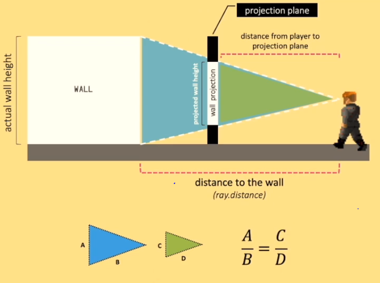

##### 🌼 raycast intersection
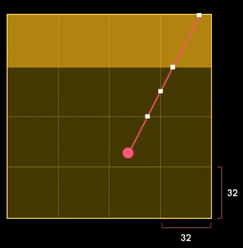

 raycast tile map  (눌러서 내용보기) 

##### 🌼 raycast tilemap
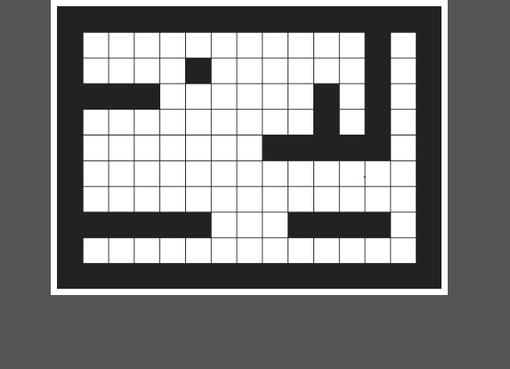

##### 🌼 raycast tilemap ray

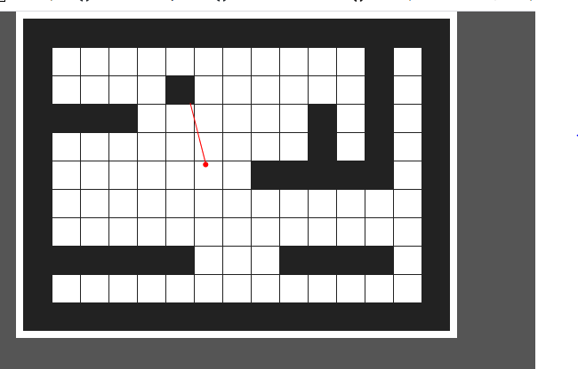
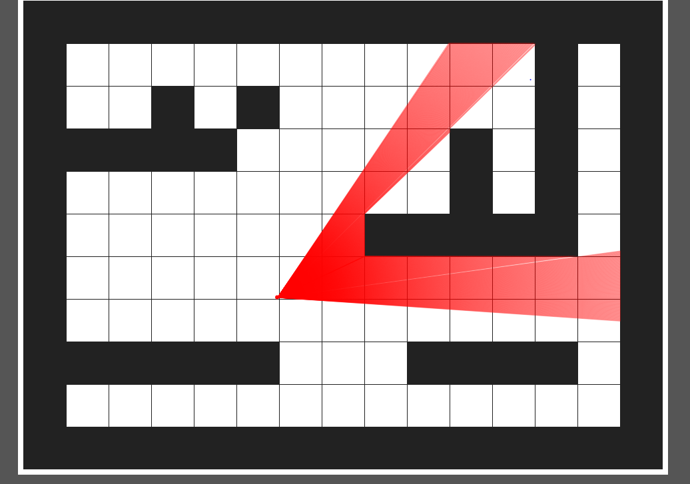

 raycast 3D rendering  (눌러서 내용보기) 

##### 🌼 raycast 3D rendering
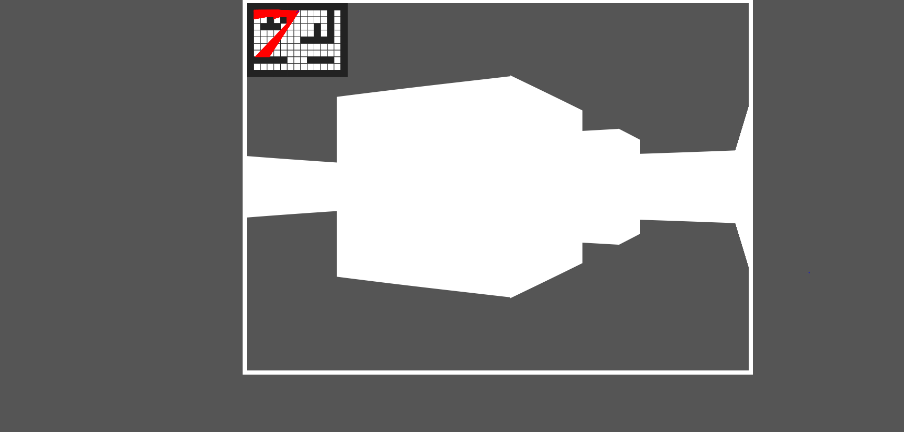
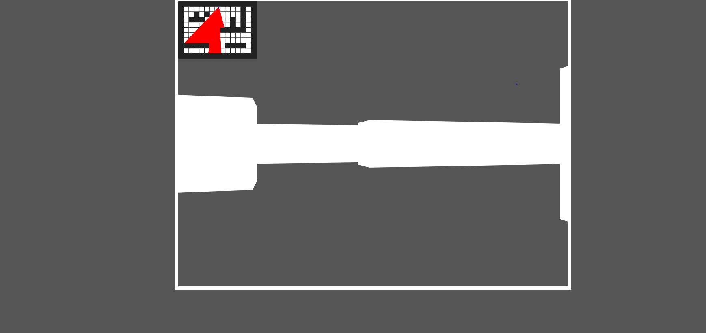

##### 🌼 raycast 3D rendering shadow
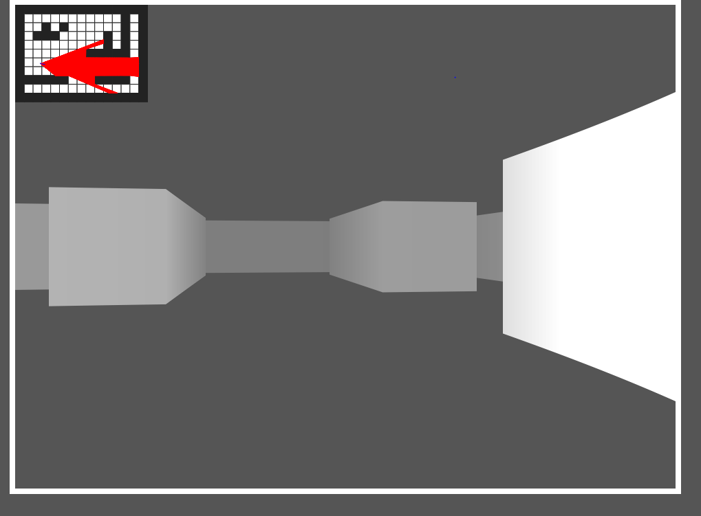

##### 🌼 raycast 3D rendering rgb
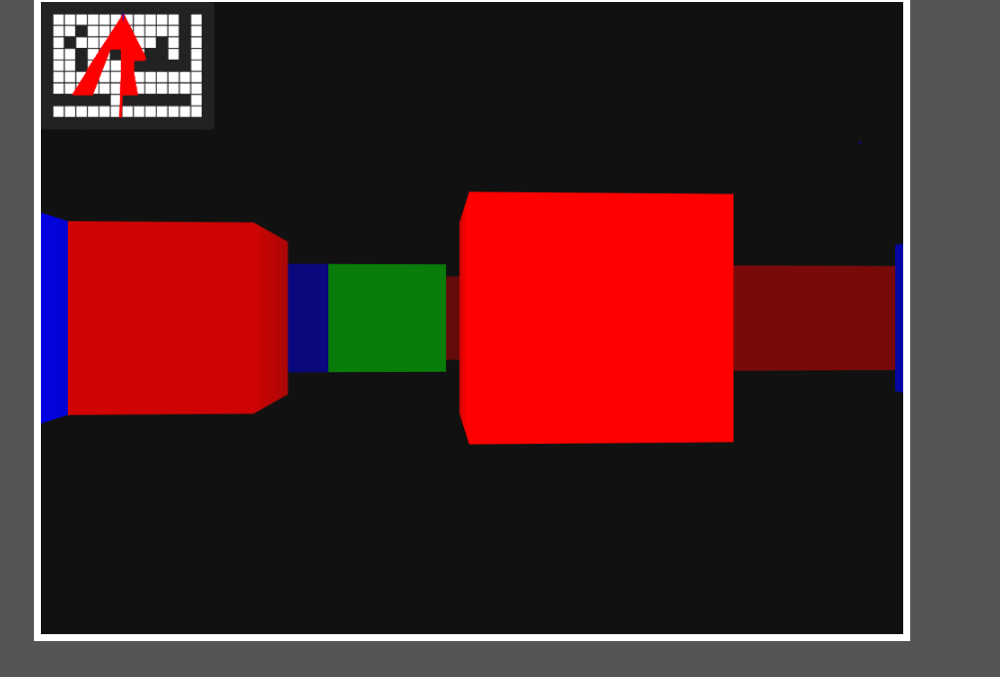

 raycast 3D rendering principle (눌러서 내용보기) 

##### 🌼 raycast 3D rendering principle
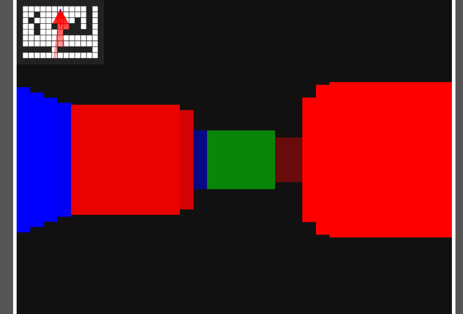
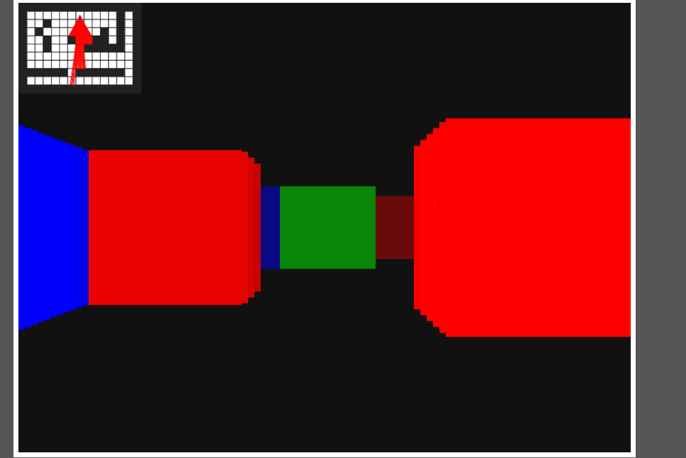

 

 참고 자료  (눌러서 내용보기) 

##### 🌼 [pikuma](https://courses.pikuma.com/)

